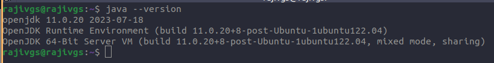
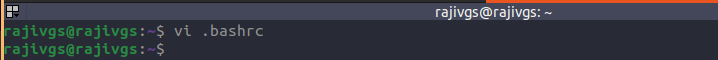
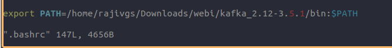
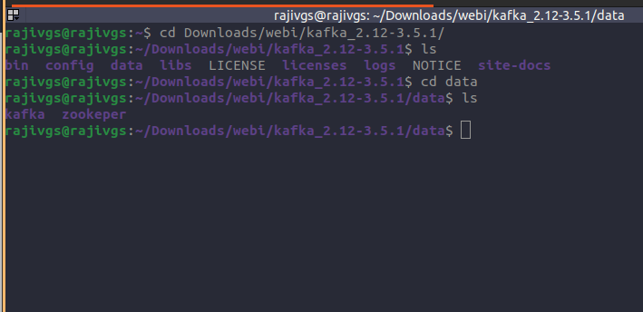

# KAFKA


***Introduction***
    
Apache Kafka is an open-source distributed event streaming platform used by thousands of companies for high-performance data pipelines, streaming analytics, data integration, and mission-critical applications.

***Why Kafka? Benefits and Use Cases***

- Data Integration
- Metrics and Monitoring
- Log Aggregation
- Stream Processing
- Publish-Subscribe Messaging
- Kafka Architecture – Fundamental Concepts
- Kafka Topics
- Kafka Partitioning


***How Kafka Partitioning Works***


- Kafka Brokers	
	Kafka brokers are like computer workers in the Kafka system. They store and handle events, manage data partitions, and work together for reliability. Think of them as the backbone of Kafka.
	So, brokers are the worker bees of the Kafka system, managing events and making sure everything runs smoothly.
	

***Replications***
    
    - To ensure data safety, Kafka creates copies of data partitions called leader and follower replicas. When you write data, it goes to the leader, and then both leader and followers automatically replicate the data. If a node fails, another takes over. As a developer, you don't need to worry much about this process. Just know your data is secure and resilient.
    Client Applications 
    - In Kafka, there are two main types of client applications: producers and consumers. Producers put messages into topics, while consumers read messages from topics. These are the building blocks for working with Kafka. Everything that's not a Kafka broker is essentially a producer or consumer, or both. They're how you connect and work with a Kafka cluster		
    Kafka Producers
    - The API surface of the producer library is fairly lightweight: In Java, there is a class called KafkaProducer that you use to connect to the cluster. 
    Kafka Consumers
    - Using the consumer API is similar in principle to the producer. You use a class called KafkaConsumer to connect to the cluster (passing a configuration map to specify the address of the cluster, security, and other parameters). 
    
***Kafka Installation***

    Prerequisite: Java 11 or 17 should be installed on the system
    https://kafka.apache.org/documentation.html#java



***Download Apache Kafka***

	https://kafka.apache.org/downloads


> - Extract or untar the downloaded kafka file
```
tar xzvf kafka_2.12-3.5.1.tgz
```


> - Now test Kafka and move the the kafka directory and use the below command    

    bin/kafka-topic.sh


> - Setting the Path 

    Open '.bashrc' file using the command: 
    vi .bashrc


> - Move to the end and set the path using the command

    export PATH=/home/rajivgs/Downloads/webi/kafka_2.12-3.5.1/bin:$PATH



> - To test, run the command from and directory.

    kafka-topic.sh


If the below output is shown, it means the path is successfully set. If not, something is wrong.


> - Starting Zookeeper Server on Linux
    
    To start zookeeper, there are following below steps used

    Step 1: Move to the and create a new directory 'data' 

    Step 2: Again, move to the data directory, and make two new directories as 'zookeeper' and 'kafka'.




To run the zookeeper server. Open the zookeeper.properties file, which is located under the config folder. 
```
 vi config/zookeeper.properties
```

Edit the value of dataDIr by placing the path of the newly created zookeeper folder.
```
 dataDir=/home/rajivgs/Downloads/webi/kafka_2.12-3.5.1/data/zookeeper

 zookeeper-server-start.sh config/zookeeper.properties 
```


```
zookeeper-server-start.sh config/zookeeper.properties
```


Move to the 'config' folder, and open server.properties file.
```
vi config/server.properties
```

    Edit the value of logs.dir=/path/data/kafka as shown below 


Now, run the Kafka server by using the following command:
```
  kafka-server-start.sh config/server.properties
```


Creating Kafka Topics
Initially, make sure that both zookeeper, as well as the Kafka server, should be started.

```
kafka-topics.sh --bootstrap-server localhost:9092 --create --topic topic-name  ||
kafka-topics.sh --bootstrap-server localhost:9092 --create --topic logger --partitions 1 --replication-factor 1
```

Here's a breakdown of the command in short points:

> - `kafka-topics.sh`: This is the Kafka command-line tool used to manage Kafka topics.
> 
> - `--bootstrap-server localhost:9092`: Specifies the Kafka broker(s) to connect to. In this case, it's connecting to a Kafka broker running locally on port 9092.
> 
> - `--create`: Indicates that you want to create a new Kafka topic.
> 
> - `--topic logger`: Specifies the name of the topic to be created, in this case, the topic name is "logger".
> 
> - `--partitions 1`: Specifies the number of partitions for the topic. Partitions are the units of parallelism in Kafka. Here, you're creating the topic with 1 partition.
> 
> - `--replication-factor 1`: Sets the replication factor for the topic. Replication ensures data durability and availability. Here, you're using a replication factor of 1, meaning there's only one copy of each partition's data.


So, the command is creating a Kafka topic named "logger" with a single partition and a replication factor of 1, connecting to a Kafka broker running on localhost at port 9092.

Listing the number of Topics
```
kafka-topics.sh --bootstrap-server localhost:9092 --list
```

- ***Describing the topic***
```
kafka-topics.sh --bootstrap-server localhost:9092 -describe --topic topic-name 
kafka-topics.sh --bootstrap-server kafka2.rajivgopalsingh.com.np:9092 -describe --topic logger-01 
```

- ***Deleting the topic***
``` 
kafka-topics.sh --bootstrap-server localhost:9092  --topic topic-name  -delete 
kafka-topics.sh --bootstrap-server kafka2.rajivgopalsingh.com.np:9092  --topic logger-01  -delete 
```

- ***Kafka Console Producer***
```
kafka-console-producer.sh --broker-list localhost:9092 --topic topic-name
```

- ***Kafka Console Consumer***
``` 
kafka-console-consumerr.sh --broker-list localhost:9092 --topic topic-name  ||
kafka-console-producer.sh --broker-list localhost:9092 --topic topic-name --from-beginning 
```


***Practice:***

    1. https://kube-logging.dev/docs/examples/kafka-nginx/
