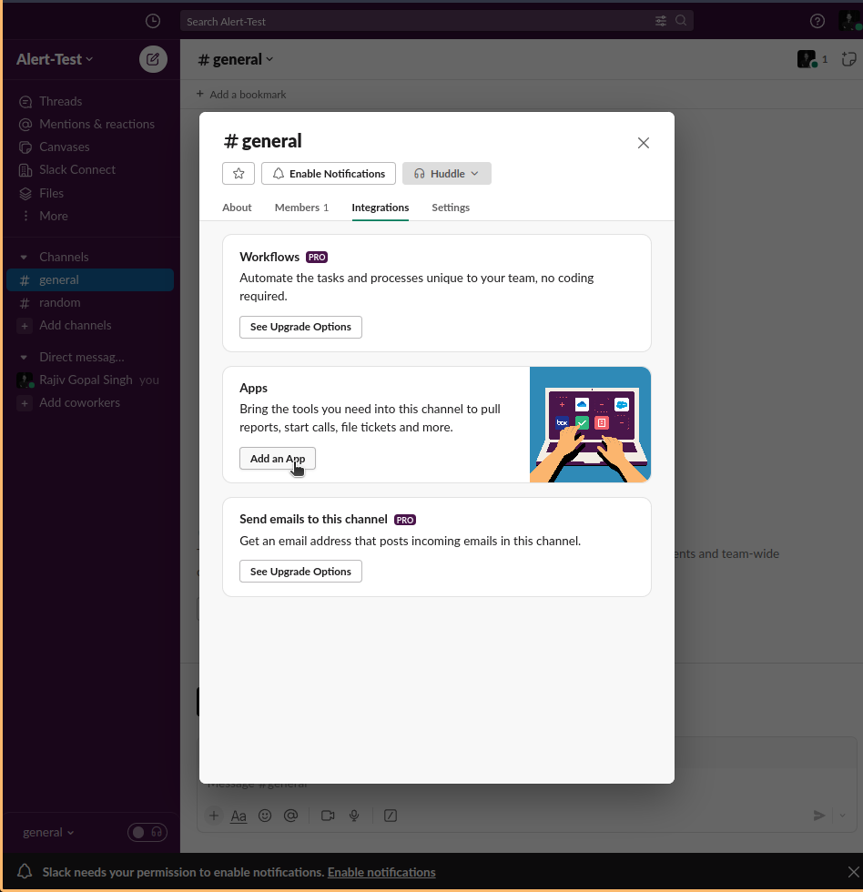

# Slack Integration 

***Setup the Prometheus and Grafana***

***Generating the Webhook of the Slack.***

***Go to app and create a new slack notifications webhooks.***




> -  ***kubectl get cm prometheus-community-alertmanager -o yaml***
```
 alertmanager.yml: |
    global:
      resolve_timeout: 1m
      slack_api_url: 'https://hooks.slack.com/services/T023XD85BFA/B05XXXXXXXXXXXXXXXXXXXXXXXXXXXXXXG00vrsFjos50iid'
    route:
      group_by: ['alertname']
      group_wait: 10s
      group_interval: 10s
      repeat_interval: 1h
      receiver: 'slack-notifications'
    receivers:
    - name: 'slack-notifications'
      slack_configs:
      - channel: '#<add here the name of the slack channel>'
        send_resolved: true
        icon_url: https://avatars3.githubusercontent.com/u/3380462
        icon_emoji: ':fire:'
        title: |-
          [{{ .Status | toUpper }}{{ if eq .Status "firing" }}:{{ .Alerts.Firing | len }}{{ end }}] {{ .CommonLabels.alertname }} for {{ .CommonLabels.job }}
          {{- if gt (len .CommonLabels) (len .GroupLabels) -}}
            {{" "}}(
            {{- with .CommonLabels.Remove .GroupLabels.Names }}
              {{- range $index, $label := .SortedPairs -}}
                {{ if $index }}, {{ end }}
                {{- $label.Name }}="{{ $label.Value -}}"
              {{- end }}
            {{- end -}}
            )
          {{- end }}
        text: |-
          {{ range .Alerts -}} *Alert:* {{ .Annotations.title }}{{ if .Labels.severity }} - `{{ .Labels.severity }}`{{ end }}
          *Description:* {{ .Annotations.description }}
          *Details:*
            {{ range .Labels.SortedPairs }} • *{{ .Name }}:* `{{ .Value }}`
            {{ end }}
          {{ end }}
    templates:
    - /etc/alertmanager/*.tmpl
```

> - ***kubectl get cm prometheus–community-server -o yaml***

```
  alerting_rules.yml: |
    groups:
    - name: alertname
      rules:
      - alert: KubernetesNodeNotReady
        expr: kube_node_status_condition{condition="Ready",status="true"} == 0
        for: 10m
        labels:
          severity: critical
        annotations:
          summary: Kubernetes node not ready (instance {{ $labels.instance }})
          description: "Node {{ $labels.node }} has been unready for a long time\n  VALUE = {{ $value }}\n  LABELS = {{ $labels }}"
      - alert: KubernetesMemoryPressure
        expr: kube_node_status_condition{condition="MemoryPressure",status="true"} == 1
        for: 2m
        labels:
          severity: critical
        annotations:
          summary: Kubernetes memory pressure (instance {{ $labels.instance }})
          description: "{{ $labels.node }} has MemoryPressure condition\n  VALUE = {{ $value }}\n  LABELS = {{ $labels }}"
      - alert: KubernetesDiskPressure
        expr: kube_node_status_condition{condition="DiskPressure",status="true"} == 1
        for: 2m
        labels:
          severity: critical
        annotations:
          summary: Kubernetes disk pressure (instance {{ $labels.instance }})
          description: "{{ $labels.node }} has DiskPressure condition\n  VALUE = {{ $value }}\n  LABELS = {{ $labels }}"
      - alert: KubernetesNetworkUnavailable
        expr: kube_node_status_condition{condition="NetworkUnavailable",status="true"} == 1
        for: 2m
        labels:
          severity: critical
        annotations:
          summary: Kubernetes network unavailable (instance {{ $labels.instance }})
          description: "{{ $labels.node }} has NetworkUnavailable condition\n  VALUE = {{ $value }}\n  LABELS = {{ $labels }}"
      - alert: KubernetesOutOfCapacity
        expr: sum by (node) ((kube_pod_status_phase{phase="Running"} == 1) + on(uid) group_left(node) (0 * kube_pod_info{pod_template_hash=""})) / sum by (node) (kube_node_status_allocatable{resource="pods"}) * 100 > 90
        for: 2m
        labels:
          severity: critical
        annotations:
          summary: Kubernetes out of capacity (instance {{ $labels.instance }})
          description: "{{ $labels.node }} is out of capacity\n  VALUE = {{ $value }}\n  LABELS = {{ $labels }}"
      - alert: KubernetesContainerOomKiller
        expr: (kube_pod_container_status_restarts_total - kube_pod_container_status_restarts_total offset 10m >= 1) and ignoring (reason) min_over_time(kube_pod_container_status_last_terminated_reason{reason="OOMKilled"}[10m]) == 1
        for: 0m
        labels:
          severity: critical
        annotations:
          summary: Kubernetes container oom killer (instance {{ $labels.instance }})
          description: "Container {{ $labels.container }} in pod {{ $labels.namespace }}/{{ $labels.pod }} has been OOMKilled {{ $value }} times in the last 10 minutes.\n  VALUE = {{ $value }}\n  LABELS = {{ $labels }}"
      - alert: KubernetesPersistentvolumeclaimPending
        expr: kube_persistentvolumeclaim_status_phase{phase="Pending"} == 1
        for: 2m
        labels:
          severity: critical
        annotations:
          summary: Kubernetes PersistentVolumeClaim pending (instance {{ $labels.instance }})
          description: "PersistentVolumeClaim {{ $labels.namespace }}/{{ $labels.persistentvolumeclaim }} is pending\n  VALUE = {{ $value }}\n  LABELS = {{ $labels }}"
      - alert: KubernetesPodCrashLooping
        expr: increase(kube_pod_container_status_restarts_total[1m]) > 3
        for: 2m
        labels:
          severity: critical
        annotations:
          summary: Kubernetes pod crash looping (instance {{ $labels.instance }})
          description: "Pod {{ $labels.pod }} is crash looping\n  VALUE = {{ $value }}\n  LABELS = {{ $labels }}"
      - alert: ImagePullBackoffAlert
        expr: kube_pod_container_status_waiting_reason{reason="ImagePullBackOff"} == 1
        for: 1m
        labels:
          severity: critical
        annotations:
          summary: "Pod {{ $labels.namespace }}/{{ $labels.pod }} is in ImagePullBackOff state"
          description: "Pod {{ $labels.namespace }}/{{ $labels.pod }} is failing to pull its container image."

```

> - ***After Completing the above steps it shows alerts like below example***


> - ***For both Gmail and Slack*** 
```
apiVersion: v1
data:
  alertmanager.yml: |-
    global:
      resolve_timeout: 1m
      slack_api_url: 'https://hooks.slack.com/services/T023XD85BFA/B05XXXXXXXXXXXXXXXXXXXXXXXXXXXXXXG00vrsFjos50iid'
    route:
      group_by: ['alertname']
      group_wait: 10s
      group_interval: 10s
      repeat_interval: 1h
      receiver: 'slack-notifications'
      routes:
        # Route for Gmail notifications
        - receiver: 'gmail-notification'
          match:
            severity: 'critical'  # Define the condition to route to Gmail
          continue: true  # Continue processing other routes
        # Route for Slack notifications
        - receiver: 'slack-notifications'
          match:
             severity: 'critical'
          continue: true
    receivers:
    - name: 'slack-notifications'
      slack_configs:
      - channel: '#lotus'
        send_resolved: true
        icon_url: https://avatars3.githubusercontent.com/u/3380462
        icon_emoji: ':fire:'
        title: |-
          [{{ .Status | toUpper }}{{ if eq .Status "firing" }}:{{ .Alerts.Firing | len }}{{ end }}] {{ .CommonLabels.alertname }} for {{ .CommonLabels.job }}
          {{- if gt (len .CommonLabels) (len .GroupLabels) -}}
            {{ " " }}(
            {{- with .CommonLabels.Remove .GroupLabels.Names }}
              {{- range $index, $label := .SortedPairs -}}
                {{ if $index }}, {{ end }}
                {{- $label.Name }}="{{ $label.Value -}}"
              {{- end }}
            {{- end -}}
            )
          {{- end }}
        text: |-
          {{ range .Alerts -}} *Alert:* {{ .Annotations.title }}{{ if .Labels.severity }} - `{{ .Labels.severity }}`{{ end }}
          *Description:* {{ .Annotations.description }}
          *Details:*
            {{ range .Labels.SortedPairs }} • *{{ .Name }}:* `{{ .Value }}`
            {{ end }}
          {{ end }}
    - name: 'gmail-notification'
      webhook_configs:
      - url: 'http://alert-manager-alertmanager-gchat-integration.zerone-monitoring.svc/alerts?room=lotus'
    templates:
    - /etc/alertmanager/*.tmpl
kind: ConfigMap
metadata:
  annotations:
    meta.helm.sh/release-name: prometheus-community
    meta.helm.sh/release-namespace: zerone-monitoring
  creationTimestamp: "2023-09-19T16:33:26Z"
  labels:
    app.kubernetes.io/instance: prometheus-community
    app.kubernetes.io/managed-by: Helm
    app.kubernetes.io/name: alertmanager
    app.kubernetes.io/version: v0.26.0
    helm.sh/chart: alertmanager-1.6.0
  name: prometheus-community-alertmanager
  namespace: zerone-monitoring
  resourceVersion: "80702"
  uid: c171403d-1beb-44a0-a39b-b62a7472695f
```


References
```
https://artifacthub.io/packages/helm/prometheus-community/prometheus
https://medium.com/globant/setup-prometheus-and-grafana-monitoring-on-kubernetes-cluster-using-helm-3484efd85891
https://grafana.com/blog/2020/02/25/step-by-step-guide-to-setting-up-prometheus-alertmanager-with-slack-pagerduty-and-gmail/
https://samber.github.io/awesome-prometheus-alerts/rules#kubernetes
```