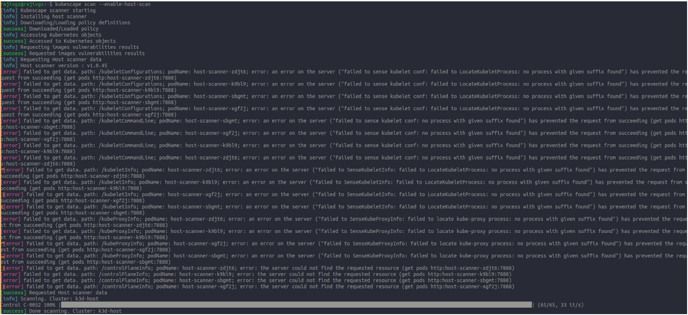
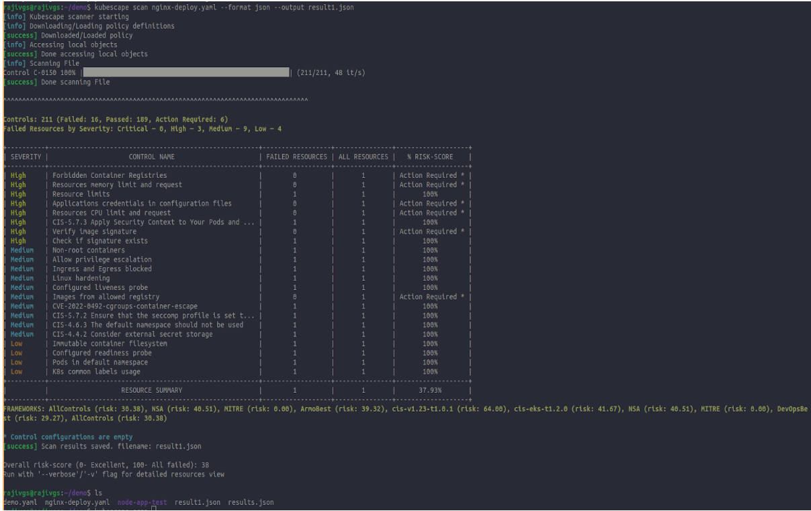

# KubeScape 

Kubescape is an open source Kubernetes security platform for your IDE, CI/CD pipelines, and clusters. Kubescape includes risk analysis, security compliance, and misconfiguration scanning.

## Installing Kubescape
 
``` 
curl -s https://raw.githubusercontent.com/kubescape/kubescape/master/install.sh | /bin/bash 
```


Run a scan
```
kubescape scan --enable-host-scan --verbose

‘kubescape scan’ : command to scan k8s clusters
‘--enable-host-scan’:  scan not just the Kubernetes cluster itself, but also the underlying hosts on which the cluster is running.
‘--verbose’: to provide additional information during the scan.
```


			Figure: Scanning the k8s cluster for Security risk and Vulnerabilities

- > ***Get results!***


			Figure: List of Security risk and Vulnerabilities

## ArmoSec with KubeScape

-  > ***Naviagte to cloud.armosec.io/account***


-  > ***Connect the K8s Cluster***


-  > ***Check the compliance***


-  > ***Check Dashboard for k8s cluster***


## Architecture of Kubescape

The main components of the Kubescape architecture are:

- ***Scanner***:

	This is the core component of Kubescape. It scans the Kubernetes cluster and identifies potential security risks and vulnerabilities. It uses different techniques to analyze the Kubernetes configuration and resources, such as identifying misconfigured network policies, insecure container images, and non-compliant Kubernetes objects.

- ***Policies***: 

	Kubescape uses a set of predefined policies to evaluate the Kubernetes environment. These policies are customizable and can be modified to suit the specific security requirements of an organization. The policies are written in YAML and can be easily extended to include additional checks.

- ***Result***: 

	The results component of Kubescape provides a detailed report of the security risks and vulnerabilities identified during the scan. It categorizes the findings based on their severity and provides remediation steps for each issue.

- ***Web interface***: 

	Kubescape comes with a web interface that allows users to interact with the tool and view the scan results. The interface provides an easy-to-use dashboard that summarizes the scan findings and allows users to drill down into specific issues.

- ***API***:
	
	 Kubescape also exposes an API that can be used to integrate with other security tools and automate the scanning process. The API can be used to trigger scans, retrieve scan results, and perform other actions programmatically.


## Usage of Kubescape
- ***Security auditing***: 
	
	Kubescape can be used to audit the security of a Kubernetes environment by scanning for security risks and vulnerabilities. It can help security teams to identify potential security issues and take the necessary steps to remediate them.

-  ***Compliance testing***: 

	Kubescape can also be used to test Kubernetes clusters against compliance standards such as PCI-DSS, HIPAA, or SOC 2. It can help organizations to ensure that their Kubernetes environments are compliant with industry standards and regulations.

-  ***DevOps integration***: 

	Kubescape can be integrated into the DevOps pipeline to perform security checks automatically. This can help organizations to ensure that their Kubernetes deployments are secure and compliant before they are deployed.

- ***Continuous Monitoring***: 
	
	Kubescape can be used to continuously monitor the security of a Kubernetes environment by running scheduled scans. This can help organizations to detect and remediate security risks and vulnerabilities in a timely manner.


## Demonstration 

Installation:
 
``` 
curl -s https://raw.githubusercontent.com/kubescape/kubescape/master/install.sh | /bin/bash 
```


```
kubescape scan  --enable-host-scan
```




		Scan the whole cluster in the system


- > ***Create and Deploy any Kubernetes Deployment file in the cluster***


- > ***Scan the created deployment file***
```	 
kubescape scan filename
```


		Scanning the deployment file with vulnerabilities

- > ***Solving the Resources Limit vulnerabilities***


		Adding the limit and request resources inside the deployment yaml file  


- > ***Resources Limit Vulnerabilities problem solved***


Figure: Resources Limit Vulnerabilities Solved


- > ***Uploading the severity in the json format***
```
kubescape scan nginx-deploy.yaml --format json --output op.json
```


		Saved the op.json file
