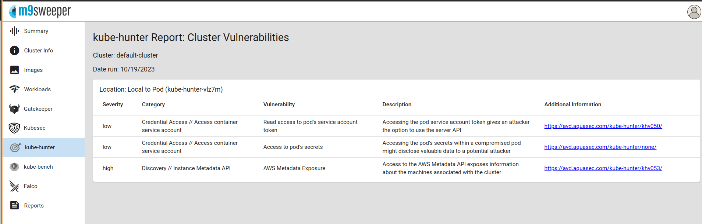
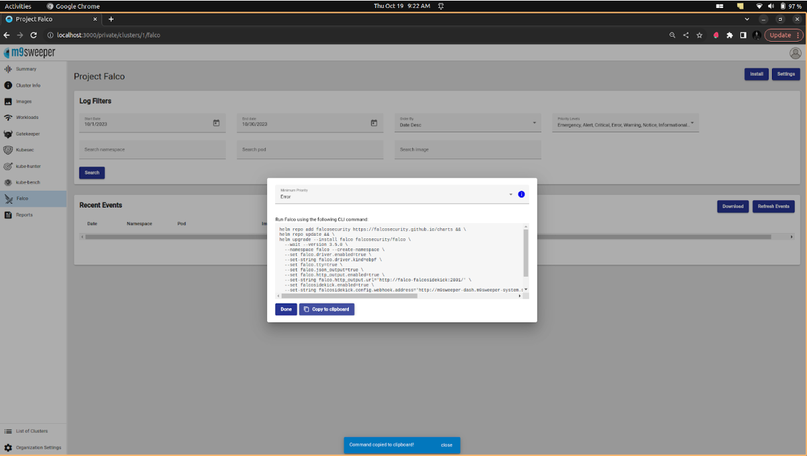

# M9Sweeper

## Introduction

  M9sweeper is a free and easy kubernetes security platform. 
  It integrates industry standard open source utilities into a one-stop-shop kubernetes security tool that can walk most kubernetes administrators through securing a kubernetes cluster as well as the apps running on the cluster.

## Feature

  M9sweeper makes securing a cluster easy with:

  - CVE Scanning
  - Enforcement of CVE Scanning Rules
  - Reports and Dashboards
  - CIS Security Benchmarking
  - Pen Testing
  - Deployment Coaching
  - Intrusion Detection
  - Gatekeeper Policy Management


### ‼️ Prerequisites

- This project requires a Kubernetes Cluster and uses helm as package manager
 Mac
Install from terminal

#### For Intel Macs
    [ $(uname -m) = x86_64 ] && curl -Lo ./kind https://kind.sigs.k8s.io/dl/v0.20.0/kind-darwin-amd64

#### For M1 / ARM Macs
    [ $(uname -m) = arm64 ] && curl -Lo ./kind https://kind.sigs.k8s.io/dl/v0.20.0/kind-darwin-arm64
    chmod +x ./kind
    mv ./kind /some-dir-in-your-PATH/kind

#### Windows
    Install with chocolatey and install a bash client

    choco install kind
    choco install git

### Start Kubernetes

    kind create cluster --name cluster_name

> Quick Installation for the M9Sweeper

```
helm repo add m9sweeper https://m9sweeper.github.io/m9sweeper 
helm repo update 
 helm install  m9sweeper m9sweeper/m9sweeper --install --wait \
  --create-namespace --namespace m9sweeper-system \
  --set-string dash.init.superAdminEmail="email" \
  --set-string dash.init.superAdminPassword="password" \
  --set-string global.jwtSecret="changeme" \
  --set-string global.apiKey="ffb40975b2694226"

```

 
### CVE Scanning 
- Common Vulnerability Exposures/Enumeration gives common names to openly known security issues or vulnerabilities. 
- The objective of CVE is to make it simpler to impart information over different databases and make available a common platform to evaluate security tools.

##### Trivy 
- Trivy is a comprehensive and versatile security scanner. 
- Trivy has scanners that look for security issues, and targets where it can find those issues.

> **Targets (what Trivy can scan):**

- Container Image
- Filesystem
- Git Repository (remote)
- Virtual Machine Image
- Kubernetes
- AWS

> **Scanners (what Trivy can find there):**

- OS packages and software dependencies in use (SBOM)
- Known vulnerabilities (CVEs)
- IaC issues and misconfigurations
- Sensitive information and secrets
- Software licences

> **How CVE Scanning works in M9Sweeper**

- Login into the M9Sweeper
- After Logged in the below dashboard is visible

Fig: M9Sweeper Dashboard
- Choose the cluster for security checkup 

Fig: Default cluster already present in the dashboard
- After choosing the cluster navigate into the Images  in the dashboard

Fig: List of Images present in the dashboard

Fig: We can manually add and scan the images using the URL

Fig: Output of the manual scan image 

Here
Can check the severity level and CVE Types explaining about the CVE Vulnerabilities Weakness,Affected Software,Potential Mitigations and References with score level.
See the details of the Compliant report 
Apply for Request Exception
	

- Enforcement of CVE Scanning Rules
	Enforcement of Common Vulnerabilities and Exposures (CVE) scanning rules is a critical aspect of maintaining the security of computer systems and networks.
  Reports and Dashboards, including historical reporting to see how your security posture has changed over time

Fig: Report summary on the dashboard

- CIS Security Benchmarking (Center for Internet Security)
- Kube-bench 
  kube-bench is a tool that checks whether Kubernetes is deployed securely by running the checks documented in the CIS Kubernetes Benchmark.

  In the context of kube-bench, "Standard Kubernetes Environment - Just Master Benchmarks" refers to a specific configuration or set of security benchmarks that are focused on the control plane components (master components) of a Kubernetes cluster. 


Fig: Selecting the k8s env for benchmark

Fig: Installation of kube-bench 

Fig: Installation Output for the benchmark 

Fig: Output

  Pen Testing
      Assess whether you are secure by running a regular, scheduled non-invasive penetration test using kube-hunter. Results can be reviewed in the user interface.
  Kube-hunter
  kube-hunter hunts for security weaknesses in Kubernetes clusters. The tool was developed to increase awareness and visibility for security issues in Kubernetes environments.


Fig: Installation command 

Fig: Installation of kube-hunter 

Fig: Waiting for the result 

Fig: Result Output 
  
  Deployment Coachings
  Ensure deployments are properly secured by reviewing your application deployments with kubesec. Ratings and summary reports are available in a simple graphical user interface.

Fig: Choose the pods from cluster or file 

Fig: Reports generate after scanning the cluster
  
  Intrusion Detection
  Monitor applications for suspicious activity and/or intrusions by hackers (such as reverse shells) using Project Falco. Detect anomalies by receiving alerts whenever a new kind of suspicious behaviour is detected.
  
  Project Falco
  	Falco is a cloud native runtime security tool for Linux operating systems. It is designed to detect and alert on abnormal behavior and potential security threats in real-time.
  
  At its core, Falco is a kernel monitoring and detection agent that observes events, such as syscalls, based on custom rules. Falco can enhance these events by integrating metadata from the container runtime and Kubernetes. The collected events can be analyzed off-host in SIEM or data lake systems.

Fig: Installation of Falco
  
#### Gatekeeper Policy Management
  Gatekeeper is an admission controller that validates requests to create and update Pods on Kubernetes clusters, using the Open Policy Agent (OPA).
   Using Gatekeeper allows administrators to define policies with a constraint, which is a set of conditions that permit or deny deployment behaviors in Kubernetes.
  Policy Controller for Kubernetes.
  
-  Installation 

Fig: Install the Gatekeeper 
Note (Gatekeeper for workloads else internal server error)

Fig: copy the command given in the clipboard and paste in the terminal 

Fig:GateKeeper Installed in the Cluster 
  
  
  
  