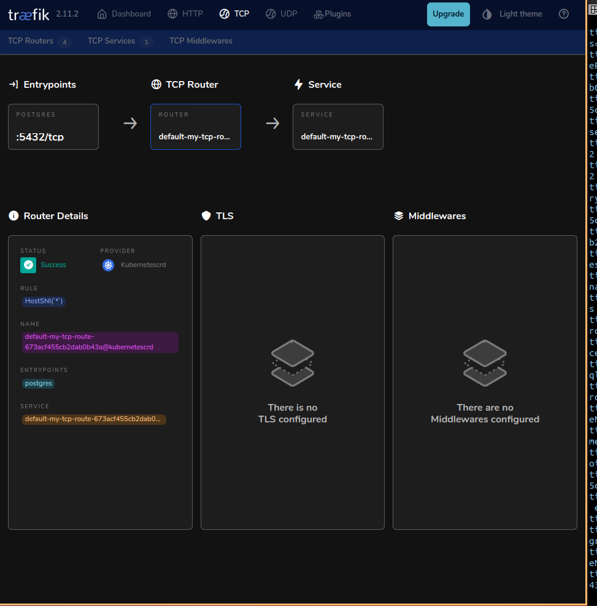
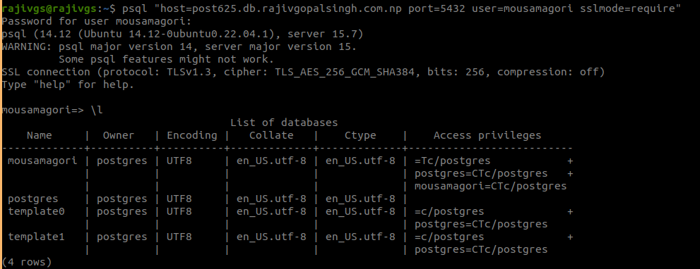

### Introduction
Traefik is based on the concept of EntryPoints, Routers, Middlewares and Services.

The main features include dynamic configuration, automatic service discovery, and support for multiple backends and protocols.

EntryPoints: EntryPoints are the network entry points into Traefik. They define the port which will receive the packets, and whether to listen for TCP or UDP.

Routers: A router is in charge of connecting incoming requests to the services that can handle them.

Middlewares: Attached to the routers, middlewares can modify the requests or responses before they are sent to your service

Services: Services are responsible for configuring how to reach the actual services that will eventually handle the incoming requests.

Applied some simple postgres manifest for the TCP routing 


Dashboard Image with the entrypoints 



Exposing the Entrypoints using the postgres 


### Installation 

    helm repo add traefik https://helm.traefik.io/traefik
    helm repo update
    helm install traefik traefik/traefik --version 28.3.0 -f values.yaml 
    
    additionalArguments: 
      - "--entryPoints.postgres.address=:5432"
      - "--entrypoints.redis.address=:6379"
      - "--entrypoints.mariadb.address=:3306"
      - "--certificatesresolvers.le-staging.acme.tlschallenge=true"
      - "--certificatesresolvers.le-staging.acme.email=xxx@gmail.com"
      - "--certificatesresolvers.le-staging.acme.storage=/data/acme.json"
      - "--certificatesresolvers.le-staging.acme.caserver=https://acme-staging-v02.api.letsencrypt.org/directory"
     #  - "--providers.kubernetesingress.ingressclass=traefik-internal"
      - "--log.level=DEBUG"
    ports:
      redis:
        port: 6379
        protocol: TCP
        expose: 
          default: true
        tls:
          enabled: true    
      postgres:
        expose:
          default: true
        exposePort: 5432
        port: 5432
        protocol: TCP
        transport:
          respondingTimeouts:
            readTimeout: 0
            writeTimeout: 0
            idleTimeout: 0
          keepAliveMaxRequests: 0
          keepAliveMaxTime: 0
      mariadb:
        expose:
          default: true
        exposePort: 3306
        port: 3306
        protocol: TCP
        transport:
          respondingTimeouts:
            readTimeout: 0
            writeTimeout: 0
            idleTimeout: 0
          keepAliveMaxRequests: 0
          keepAliveMaxTime: 0

### Redis 
    Installation 

    helm repo add bitnami https://charts.bitnami.com/bitnami
    helm install my-redis bitnami/redis --version 19.5.5

* > Manifest the IngressRouteTCP for Redis 
```
apiVersion: traefik.io/v1alpha1
kind: IngressRouteTCP
metadata:
  name: redis-service-tcp-clone-1
  namespace: redis
spec:
  entryPoints:
    - redis
  routes:
  - match: HostSNI(`redis1.db.rajivgopalsingh.com.np`)
    services:
    - name: redis-master
      namespace: redis
      port: 6379
  tls:
    certResolver: le-staging
    passthrough: false
```

* > Test the Redis server using the CLI 
```
redis-cli -h redis1.db.rajivgopalsingh.com.np -p 6379 -a qk50H1nOdY --tls --sni redis1.db.rajivgopalsingh.com.np
```
Note: 
```
when changing the values of the tls.passthrough: true occurs
 Error: Protocol error, got "H" as reply type byte
```

### PostgreSQL

Tested with the Crunchy Postgres and CloudNative PG
 CrunchyData PG

    Installation:
    kubectl create -f https://operatorhub.io/install/postgresql.yaml

 CloudNative PG 

    Installation:
    kubectl create -f https://operatorhub.io/install/cloudnative-pg.yaml

 Bitnami PG
    helm repo add bitnami https://charts.bitnami.com/bitnami
    helm install my-postgresql bitnami/postgresql --version 15.5.7

IngressRouteTCP manifest for the PG
```
apiVersion: traefik.io/v1alpha1
kind: IngressRouteTCP
metadata:
  name: deployment-625-postgres-ha
  namespace: env-203
spec:
  entryPoints:
    - postgres
  routes:
  - match: HostSNI(`*`)
    services:
    - name: deployment-625-postgres-ha
      namespace: env-203
      port: 5432
  tls:
    certResolver: le-staging
    domains:                   
    - main: db.rajivgopalsingh.com.np        
      sans:                    
      - postgres625.db.rajivgopalsingh.com.np
      - post625.db.rajivgopalsingh.com.np
    passthrough: true 
---
apiVersion: traefik.io/v1alpha1
kind: IngressRouteTCP
metadata:
  name: deployment-626-postgres-ha
  namespace: env-203
spec:
  entryPoints:
    - postgres
  routes:
  - match: HostSNI(`postgres626.db.rajivgopalsingh.com.np`)
    services:
    - name: deployment-626-postgres-ha
      namespace: env-203
      port: 5432
  tls:
    certResolver: le-staging
    passthrough: true 
```
Output



 

### MariaDB 

    helm repo add bitnami https://charts.bitnami.com/bitnami
    helm install my-mariadb bitnami/mariadb --version 18.2.4

Manifest IngressRouteTCP for the MariaDB

```

 apiVersion: traefik.io/v1alpha1
 kind: IngressRouteTCP
 metadata:
   name: deployment-628-mariadb
   namespace: env-203
 spec:
   entryPoints:
     - mariadb
   routes:
   - match: HostSNI(`*`)
     services:
     - name: deployment-628-mariadb
       namespace: env-203
       port: 3306
```

    Currently while setuping the MariaDB the above manifest is working only if we are providing the  wildcard in the HOSTSNI 
    
Output

 


Mongodb
    helm repo add bitnami https://charts.bitnami.com/bitnami
    helm install my-mongodb bitnami/mongodb --version 15.6.11


```
apiVersion: traefik.io/v1alpha1
kind: IngressRouteTCP
metadata:
  name: mongodb
spec:
  entryPoints:
	- mongodb
  routes:
	- match: HostSNI(`mongodb.db.umeshkhatiwada.com.np`)
  	priority: 10
  	services:
    	- name: my-mongodb
      	port: 27017
      	weight: 10
  tls:
	certResolver: le-staging
	passthrough: false
```

Cmd: mongo --host host1.com --port 27017 -u root -p cRIt05TMRr --authenticationDatabase admin --ssl --sslAllowInvalidCertificates


### Rabbitmq

    helm repo add bitnami https://charts.bitnami.com/bitnami
    helm install my-rabbitmq bitnami/rabbitmq --version 14.4.4

```
apiVersion: traefik.io/v1alpha1
kind: IngressRouteTCP
metadata:
  name: rabbitmq
spec:
  entryPoints:
	- amqp
  routes:
	- match: HostSNI(`rabbitmq.db.umeshkhatiwada.com.np`)
  	priority: 10
  	services:
    	- name: my-rabbitmq
      	port: 5672
      	weight: 10
  tls:
	certResolver: le-staging
	passthrough: false
```

Testscript:
```

import pika
import ssl
import socket

# RabbitMQ server configuration
hostname = 'host1.com'  # Replace with your RabbitMQ server hostname or IP address
port = 5672  # Default RabbitMQ SSL port
username = 'user'  # RabbitMQ username
password = 'BE9zlp2MQugpQVbY'  # RabbitMQ password
virtual_host = '/'  # RabbitMQ virtual host

# SSL/TLS configuration
context = ssl.create_default_context()

# Disable hostname checking and certificate verification for self-signed certificates
context.check_hostname = False
context.verify_mode = ssl.CERT_NONE

# TCP Keep-Alive settings
socket.setdefaulttimeout(10)
socket.socket(socket.AF_INET, socket.SOCK_STREAM).setsockopt(socket.SOL_SOCKET, socket.SO_KEEPALIVE, 1)
socket.socket(socket.AF_INET, socket.SOCK_STREAM).setsockopt(socket.IPPROTO_TCP, socket.TCP_KEEPIDLE, 1)
socket.socket(socket.AF_INET, socket.SOCK_STREAM).setsockopt(socket.IPPROTO_TCP, socket.TCP_KEEPINTVL, 1)
socket.socket(socket.AF_INET, socket.SOCK_STREAM).setsockopt(socket.IPPROTO_TCP, socket.TCP_KEEPCNT, 5)

# Connect to RabbitMQ server with SSL
credentials = pika.PlainCredentials(username, password)
parameters = pika.ConnectionParameters(
	host=hostname,
	port=port,
	virtual_host=virtual_host,
	credentials=credentials,
	ssl_options=pika.SSLOptions(context)
)
try:
	connection = pika.BlockingConnection(parameters)
	channel = connection.channel()

	# Declare a queue
	queue_name = 'hello'
	channel.queue_declare(queue=queue_name)

	# Publish a message to the queue
	message = 'Hello, RabbitMQ with SSL!'
	channel.basic_publish(exchange='', routing_key=queue_name, body=message)
	print(f" [x] Sent '{message}'")

	# Close connection
	connection.close()
except Exception as e:
	print(f"Failed to connect to RabbitMQ server: {e}")
```

## Reference

* > Is it possible to use Traefik to proxy PostgreSQL over SSL?
* > 🔨 Support Traefik v3 features · Issue #757 · traefik/traefik-helm-chart 
* > How to connect to Traefik TCP Services with TLS configuration enabled? 
* > Release v3.0.0-rc5 · traefik/traefik 
* > Using Traefik as Ingress on different MetalLB loadbalancerIP? 
* > Exposing a postgres service through Traefik IngressRouteTCP and Cloudflare DNS 


## Workshop

* > GitHub - traefik-workshops/traefik-workshop

    Getting started with Traefik on Kubernetes. A few exercises that help you to start the journey with Traefik Proxy. 

